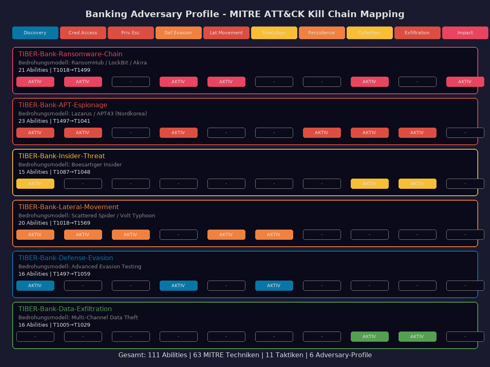
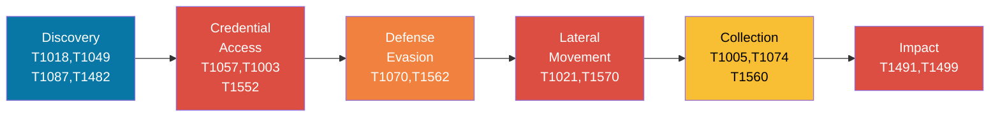
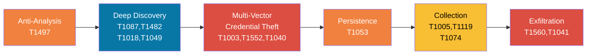
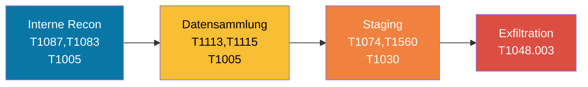
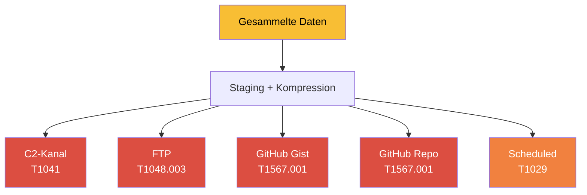
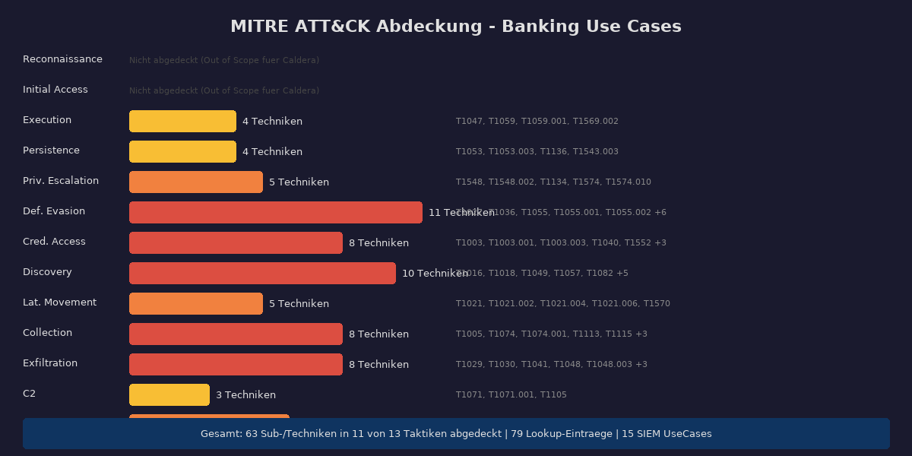

# Adversary Profile - Banking Bedrohungsszenarien

> 6 Caldera-Profile basierend auf realen Bedrohungen für Banken 2025/2026

## Übersicht

| # | Profil | Bedrohungsmodell | Abilities | Schwerpunkt |
|---|--------|-----------------|-----------|-------------|
| 1 | [Ransomware Chain](#1-ransomware-chain) | RansomHub/LockBit/Akira | 21 | Vollständige Ransomware Kill Chain |
| 2 | [APT Espionage](#2-apt-espionage) | Lazarus/APT43 | 23 | Stille Kompromittierung + Exfil |
| 3 | [Insider Threat](#3-insider-threat) | Böswilliger Insider | 15 | Datendiebstahl ohne Priv Esc |
| 4 | [Lateral Movement](#4-lateral-movement) | Scattered Spider/Volt Typhoon | 20 | Netzwerksegmentierung testen |
| 5 | [Defense Evasion](#5-defense-evasion) | Fortgeschrittener Angreifer | 16 | SIEM-Erkennung testen |
| 6 | [Data Exfiltration](#6-data-exfiltration) | Multi-Channel Exfil | 16 | DLP-Kontrollen testen |

---

## 1. Ransomware Chain

**Datei:** `bank-ransomware-chain.yml`
**ID:** `b4nk-r4ns-0001-aaaa-000000000001`

### Bedrohungsmodell
Simuliert eine vollständige Ransomware-Angriffskette orientiert an **RansomHub**, **LockBit** und **Akira** (2024-2026). Diese Gruppen gehörten zu den aktivsten Ransomware-Akteuren gegen Finanzinstitute.

### Kill Chain

### Abilities (21)

| Phase | Ability | MITRE | Beschreibung |
|-------|---------|-------|-------------|
| 1 - Discovery | ARP Cache | T1018 | Netzwerk-Reconnaissance |
| 1 | Network Connections | T1049 | Aktive Verbindungen |
| 1 | Find Local Users | T1087.001 | Benutzer-Enumeration |
| 1 | Account Discovery Domain | T1087.002 | AD-Konten |
| 1 | GetDomain | T1482 | Domain Trust Discovery |
| 2 - Credentials | Find LSASS | T1057 | LSASS-Prozess finden |
| 2 | Procdump LSASS | T1003.001 | Memory Dump |
| 2 | PowerKatz | T1003.001 | Mimikatz-Ausführung |
| 2 | Registry Credentials | T1552.002 | Credentials aus Registry |
| 3 - Evasion | Avoid Logs | T1070.003 | Command History löschen |
| 3 | Disable Defender | T1562.001 | Windows Defender deaktivieren |
| 3 | Clear Event Logs | T1070.001 | Windows Events löschen |
| 4 - Lateral | Copy via SMB | T1021.002 | Agent über SMB verbreiten |
| 4 | Net Use | T1021.002 | SMB Share mounten |
| 4 | Copy via WinRM/SCP | T1570 | Tool Transfer |
| 5 - Collection | Find Files | T1005 | Sensitive Dateien finden |
| 5 | Stage Files | T1074.001 | Dateien sammeln |
| 5 | Compress | T1560.001 | Archiv erstellen |
| 6 - Impact | Leave Note | T1491 | Ransomware-Nachricht |
| 6 | Shutdown | T1499 | System herunterfahren |

### SIEM-Erkennung
Sollte folgende Use Cases triggern: **UC-001** (Credentials), **UC-003** (Recon), **UC-004** (Lateral), **UC-006** (Exfil), **UC-007** (Evasion), **UC-009** (Logs), **UC-010** (Data), **UC-012** (Ransomware)

---

## 2. APT Espionage

**Datei:** `bank-apt-espionage.yml`
**ID:** `b4nk-4pt3-0002-bbbb-000000000002`

### Bedrohungsmodell
Simuliert einen **staatlich gestützten APT-Angriff** nach dem Muster von **Lazarus Group** und **APT43** (Nordkorea). Fokus auf langfristige, stille Kompromittierung mit dem Ziel Finanzdaten zu stehlen.

### Kill Chain

### Besonderheiten
- **Anti-Sandbox**: Prüft auf Analyse-Umgebungen vor dem eigentlichen Angriff
- **Timing**: 1-Minuten-Sleep als Sandbox-Evasion
- **Multi-Vector Credentials**: LSASS-Dump, Command History, SSH Keys, Network Sniffing
- **Persistenz**: Cron-Jobs für Root und User

---

## 3. Insider Threat

**Datei:** `bank-insider-threat.yml`
**ID:** `b4nk-1ns1-0003-cccc-000000000003`

### Bedrohungsmodell
Simuliert einen **böswilligen Insider** mit legitimem Systemzugang. Keine Privilege Escalation nötig - der Angreifer nutzt seine vorhandenen Berechtigungen.

### Kill Chain

### Besonderheiten
- **Keine Privilege Escalation** - nutzt vorhandene Rechte
- **Screen Capture + Clipboard** - sammelt auch visuelle Daten
- **Chunked Transfer** - teilt Daten in kleine Stücke zur Vermeidung von DLP
- **FTP-Exfiltration** - nicht über C2-Kanal

---

## 4. Lateral Movement

**Datei:** `bank-lateral-movement.yml`
**ID:** `b4nk-l4tm-0004-dddd-000000000004`

### Bedrohungsmodell
Orientiert an **Scattered Spider** und **Volt Typhoon**. Fokus auf Living-off-the-Land Techniken und Bewegung durch Netzwerksegmente.

### Besonderheiten
- **5 verschiedene Lateral Movement Methoden**: SMB, WinRM, SSH, SCP, Mount
- **UAC-Bypass** als Vorbereitung
- **Service Creation** auf Zielsystemen
- Testet explizit **Netzwerksegmentierung**

---

## 5. Defense Evasion

**Datei:** `bank-defense-evasion.yml`
**ID:** `b4nk-3v4s-0005-eeee-000000000005`

### Bedrohungsmodell
Testet die **Erkennungsfähigkeit** der Bank-SIEM-Infrastruktur. Simuliert einen Angreifer der aktiv versucht Sicherheitskontrollen zu umgehen.

### Besonderheiten
- **Sandbox-Detection**: Prüft auf Analyse-Tools
- **AV/EDR-Deaktivierung**: Windows Defender komplett deaktivieren
- **Process Injection**: Code in laufende Prozesse injizieren (Mavinject, odbcconf)
- **Log-Bereinigung**: Event Logs, Command History, Payload-Artefakte löschen

---

## 6. Data Exfiltration

**Datei:** `bank-data-exfil.yml`
**ID:** `b4nk-3xf1-0006-ffff-000000000006`

### Bedrohungsmodell
Testet **DLP-Kontrollen** und die Fähigkeit unautorisierten Datenabfluss über verschiedene Kanäle zu erkennen.

### Exfiltrationskanäle

---

## MITRE ATT&CK Coverage

