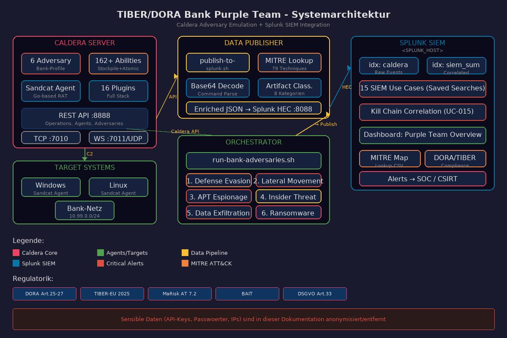
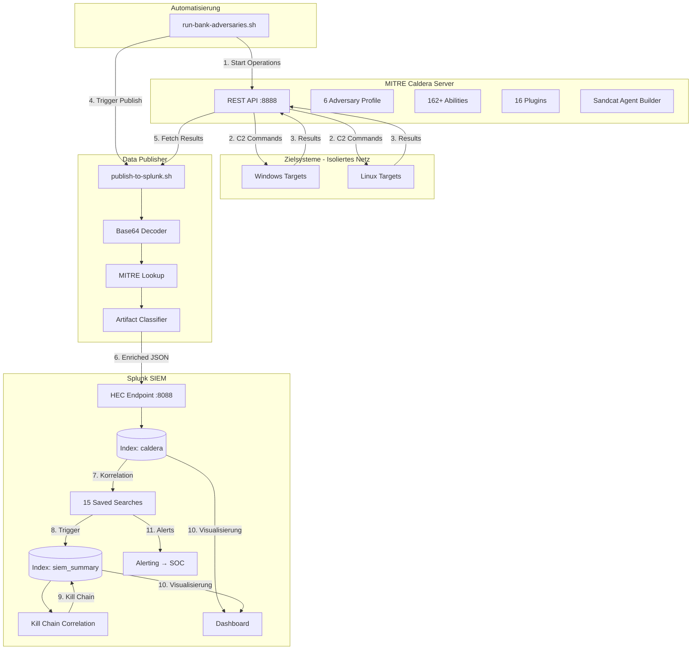
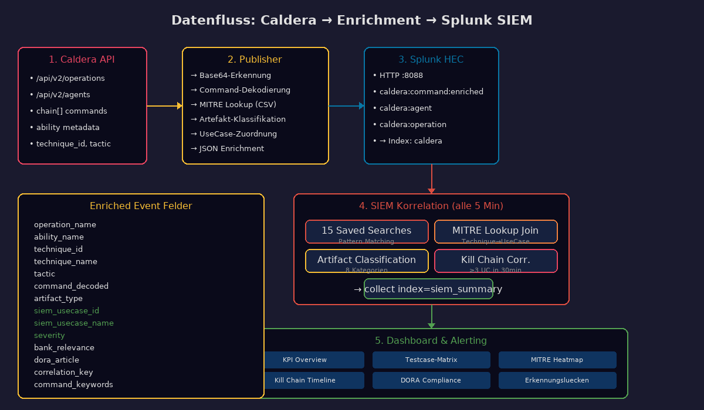
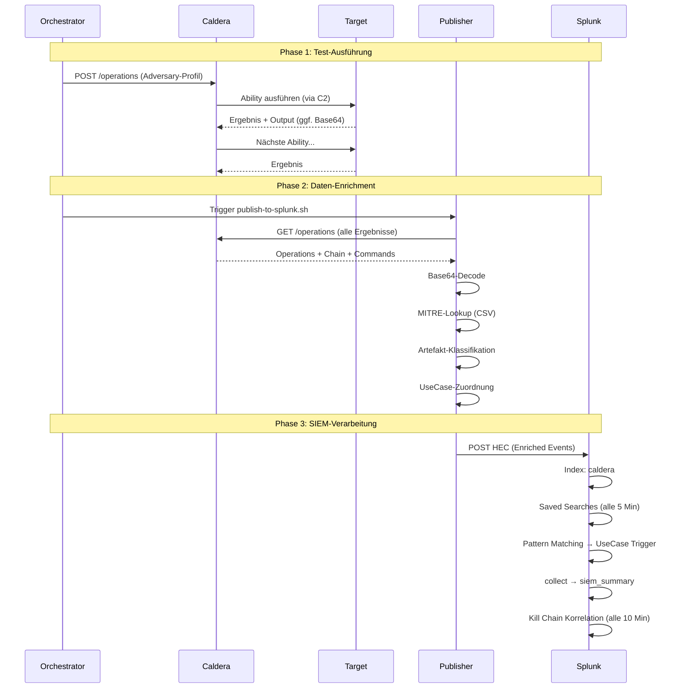
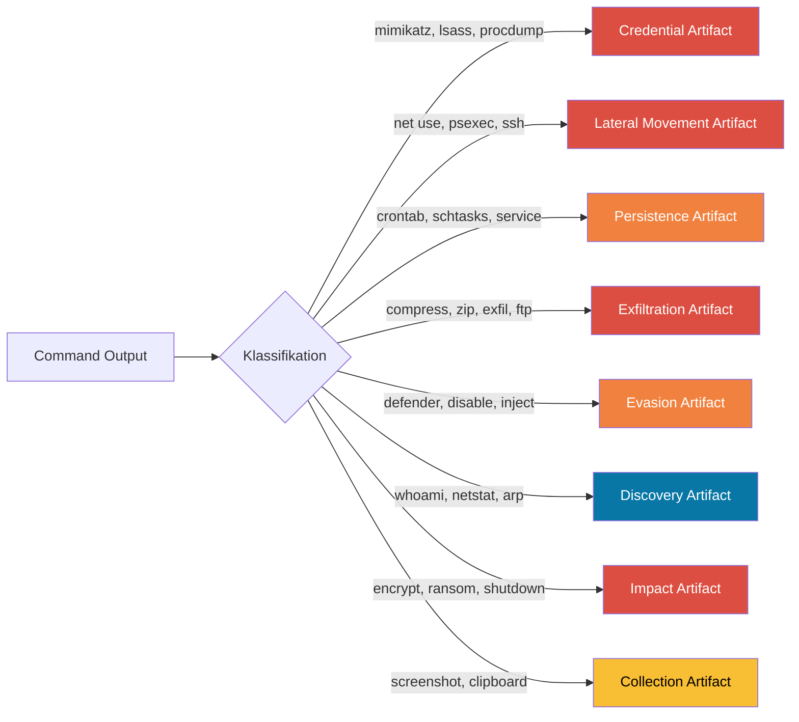

# Systemarchitektur

> Datenfluss und Komponentenübersicht

## Gesamtarchitektur





## Datenfluss im Detail





## Verzeichnisstruktur

```
/opt/caldera/                        # Caldera Installation
├── server.py                        # Hauptprogramm
├── conf/
│   ├── default.yml                  # Standard-Konfiguration
│   └── local.yml                    # Lokale Konfiguration (NICHT committen!)
├── data/
│   ├── adversaries/
│   │   ├── bank-ransomware-chain.yml
│   │   ├── bank-apt-espionage.yml
│   │   ├── bank-insider-threat.yml
│   │   ├── bank-lateral-movement.yml
│   │   ├── bank-defense-evasion.yml
│   │   └── bank-data-exfil.yml
│   └── backup/
└── plugins/
    └── stockpile/data/abilities/    # 162 vordefinierte Abilities

/opt/caldera-splunk/                 # Splunk-Integration
├── publish-to-splunk.sh             # Enrichment + HEC Publisher
├── run-bank-adversaries.sh          # Test-Orchestrator
├── install-splunk-app.sh            # Splunk Remote-Installer
├── siem/
│   ├── siem_usecases_savedsearches.conf
│   ├── indexes.conf
│   ├── props.conf
│   └── transforms.conf
├── dashboards/
│   └── bank_purple_team_dashboard.xml
├── lookups/
│   └── mitre_attack_bank_mapping.csv
└── docs/
    └── SIEM_USECASES_DOKUMENTATION.md
```

## Artefakt-Klassifikation


