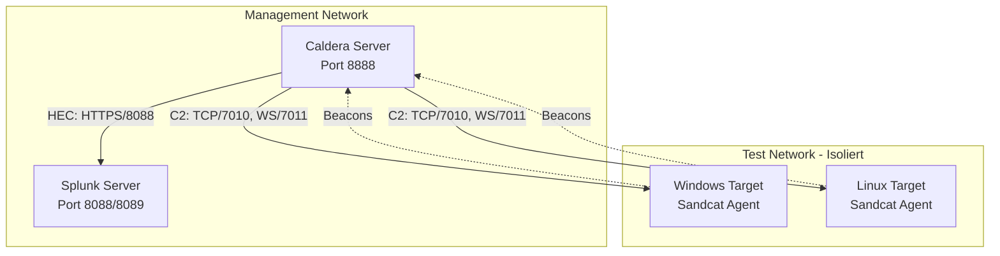
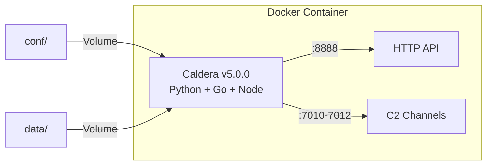
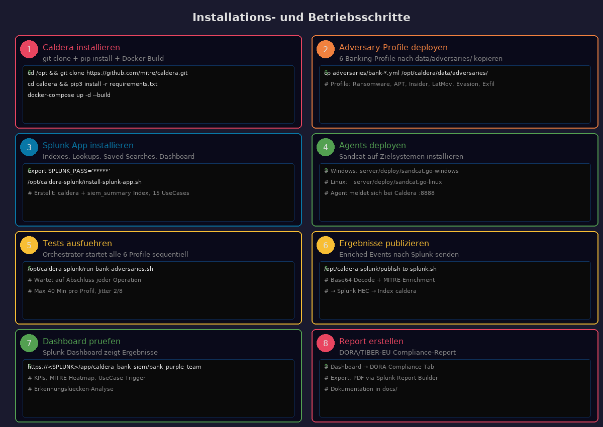
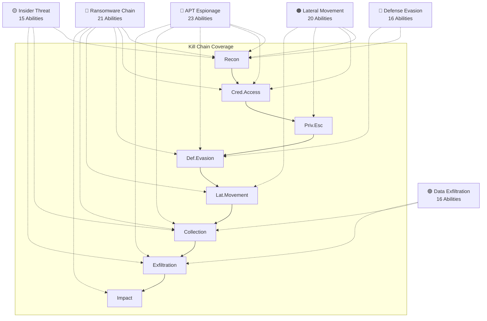
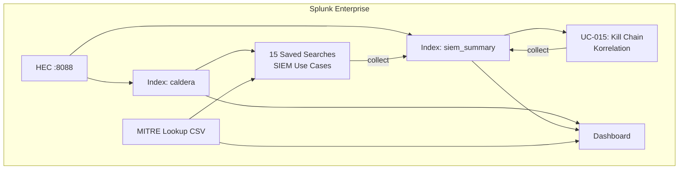
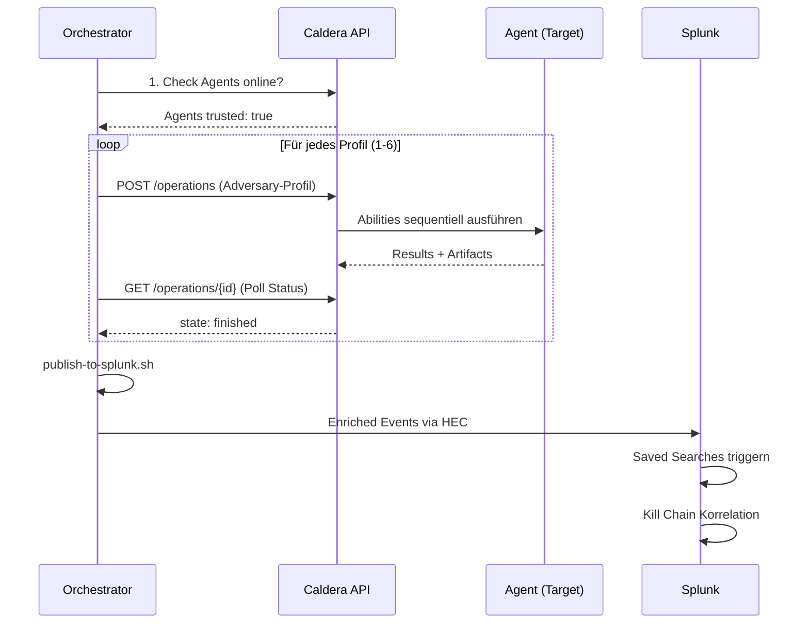
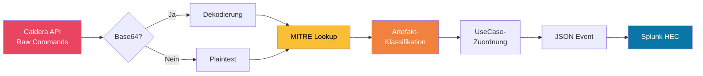
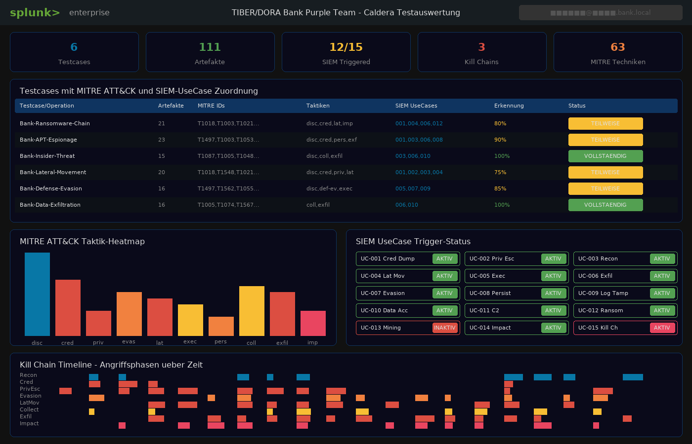
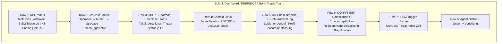

# Betriebs- und Administrationshandbuch

> TIBER/DORA Bank Purple Team Testing Framework
> Version 1.0 | März 2026

---

## Inhaltsverzeichnis

1. [Systemvoraussetzungen](#1-systemvoraussetzungen)
2. [Installation Caldera](#2-installation-caldera)
3. [Adversary-Profile deployen](#3-adversary-profile-deployen)
4. [Splunk-Konfiguration](#4-splunk-konfiguration)
5. [Agents deployen](#5-agents-deployen)
6. [Tests ausführen](#6-tests-ausführen)
7. [Ergebnisse publizieren](#7-ergebnisse-publizieren)
8. [Dashboard und Auswertung](#8-dashboard-und-auswertung)
9. [Troubleshooting](#9-troubleshooting)
10. [Wartung und Updates](#10-wartung-und-updates)

---

## 1. Systemvoraussetzungen

### Caldera-Server

| Komponente | Anforderung |
|-----------|-------------|
| OS | Ubuntu 22.04 LTS oder Debian 12 |
| CPU | 4 Cores (min. 2) |
| RAM | 8 GB (min. 4 GB) |
| Disk | 50 GB |
| Python | 3.10+ |
| Go | 1.21+ (für Payload-Kompilierung) |
| Docker | 24+ (optional, für Container-Betrieb) |
| Git | 2.x |

### Splunk-Server

| Komponente | Anforderung |
|-----------|-------------|
| Splunk Enterprise | 9.x |
| HEC (HTTP Event Collector) | Aktiviert, Port 8088 |
| Indexes | `caldera`, `siem_summary` (werden automatisch erstellt) |
| Speicher | ~10 GB für caldera Index, ~5 GB für siem_summary |

### Netzwerk



> **Wichtig:** Das Testnetzwerk MUSS vom Produktionsnetzwerk isoliert sein!

---

## 2. Installation Caldera

### Schritt 2.1: System vorbereiten

```bash
# System aktualisieren
apt update && apt upgrade -y

# Abhängigkeiten installieren
apt install -y python3 python3-pip python3-venv git golang-go \
    mingw-w64 curl jq

# Go installieren (falls Version zu alt)
wget https://go.dev/dl/go1.22.0.linux-amd64.tar.gz
rm -rf /usr/local/go && tar -C /usr/local -xzf go1.22.0.linux-amd64.tar.gz
export PATH=$PATH:/usr/local/go/bin
```

### Schritt 2.2: Caldera klonen und installieren

```bash
cd /opt
git clone --recursive https://github.com/mitre/caldera.git
cd caldera

# Python-Abhängigkeiten
pip3 install -r requirements.txt

# Frontend bauen (optional, für UI)
cd plugins/magma && npm install && npm run build && cd ../..
```

### Schritt 2.3: Konfiguration

```bash
# Konfigurationsdatei erstellen
cp conf/default.yml conf/local.yml
```

Bearbeite `conf/local.yml` und setze:

```yaml
# WICHTIG: Eigene Werte setzen!
users:
  red:
    red: EIGENES_PASSWORT_HIER
  blue:
    blue: EIGENES_PASSWORT_HIER

api_key_red: EIGENER_API_KEY_HIER
api_key_blue: EIGENER_API_KEY_HIER

# Netzwerk - an eigene Umgebung anpassen
app.contact.http: http://CALDERA_IP:8888
```

> **Sicherheitshinweis:** Niemals Standard-Credentials in Produktion verwenden!

### Schritt 2.4: Caldera starten

```bash
# Direkt starten
python3 server.py --log DEBUG

# Oder als systemd Service
cat > /etc/systemd/system/caldera.service << 'EOF'
[Unit]
Description=MITRE Caldera Server
After=network.target

[Service]
Type=simple
WorkingDirectory=/opt/caldera
ExecStart=/usr/bin/python3 server.py --log DEBUG
Restart=on-failure
RestartSec=10

[Install]
WantedBy=multi-user.target
EOF

systemctl daemon-reload
systemctl enable --now caldera
```

### Schritt 2.5: Docker-Alternative

```bash
cd /opt/caldera
docker-compose up -d --build
```



### Schritt 2.6: Health Check

```bash
# Caldera Health prüfen
curl -s http://localhost:8888/api/v2/health | jq .

# Erwartete Antwort:
# {"system": "running", "version": "5.0.0"}
```



---

## 3. Adversary-Profile deployen

### Schritt 3.1: Profile kopieren

```bash
# Aus diesem Repository
cp caldera/adversaries/bank-*.yml /opt/caldera/data/adversaries/
```

### Schritt 3.2: Profile verifizieren

```bash
# Profile über API prüfen
curl -s -H "KEY: $API_KEY" \
  http://localhost:8888/api/v2/adversaries | \
  jq '.[] | select(.name | startswith("TIBER")) | {name, adversary_id}'
```

Erwartete Ausgabe:
```json
{"name": "TIBER-Bank-Ransomware-Chain", "adversary_id": "b4nk-r4ns-0001-aaaa-000000000001"}
{"name": "TIBER-Bank-APT-Espionage", "adversary_id": "b4nk-4pt3-0002-bbbb-000000000002"}
{"name": "TIBER-Bank-Insider-Threat", "adversary_id": "b4nk-1ns1-0003-cccc-000000000003"}
{"name": "TIBER-Bank-Lateral-Movement", "adversary_id": "b4nk-l4tm-0004-dddd-000000000004"}
{"name": "TIBER-Bank-Defense-Evasion", "adversary_id": "b4nk-3v4s-0005-eeee-000000000005"}
{"name": "TIBER-Bank-Data-Exfiltration", "adversary_id": "b4nk-3xf1-0006-ffff-000000000006"}
```

### Schritt 3.3: Profilübersicht




---

## 4. Splunk-Konfiguration

### Schritt 4.1: Automatische Installation

```bash
# Umgebungsvariablen setzen
export SPLUNK_HOST="<SPLUNK_IP>"
export SPLUNK_MGMT_PORT="8089"
export SPLUNK_USER="admin"
export SPLUNK_PASS="<SPLUNK_ADMIN_PASSWORT>"
export SPLUNK_HEC_TOKEN="<DEIN_HEC_TOKEN>"

# Installer ausführen
./scripts/install-splunk-app.sh
```

Das Script erstellt automatisch:
- Splunk App: `caldera_bank_siem`
- Index: `caldera` (Rohdaten)
- Index: `siem_summary` (korrelierte Events)
- Lookup: `mitre_attack_bank_mapping.csv`
- 15 Saved Searches (SIEM Use Cases)
- Dashboard: `bank_purple_team`

### Schritt 4.2: Manuelle Installation (Alternative)

Falls die automatische Installation nicht funktioniert:

**Indexes anlegen:**
```
Settings → Indexes → New Index
  Name: caldera       | Max Size: 10 GB
  Name: siem_summary  | Max Size: 5 GB
```

**Lookup hochladen:**
```
Settings → Lookups → Lookup table files → New
  Datei: splunk/lookups/mitre_attack_bank_mapping.csv
  Ziel-App: caldera_bank_siem
```

**Saved Searches importieren:**
```
Kopiere splunk/siem/siem_usecases_savedsearches.conf nach:
$SPLUNK_HOME/etc/apps/caldera_bank_siem/local/savedsearches.conf
```

**Dashboard importieren:**
```
Settings → User Interface → Views → New
  ID: bank_purple_team
  XML: Inhalt von splunk/dashboards/bank_purple_team_dashboard.xml
```

### Schritt 4.3: HEC konfigurieren

```
Settings → Data Inputs → HTTP Event Collector
  → Global Settings: Enabled, Port 8088
  → New Token:
    Name: caldera_bank
    Indexes: caldera, siem_summary
    Default Index: caldera
```

### Schritt 4.4: Splunk neu starten

```bash
$SPLUNK_HOME/bin/splunk restart
```



---

## 5. Agents deployen

### Schritt 5.1: Sandcat Agent herunterladen

Über die Caldera-UI oder direkt:

```bash
# Linux Agent
curl -s -X POST http://CALDERA:8888/file/download \
  -H "KEY: $API_KEY" \
  -d '{"file":"sandcat.go-linux"}' > sandcat-linux
chmod +x sandcat-linux

# Windows Agent (auf Windows-Ziel)
Invoke-WebRequest -Uri "http://CALDERA:8888/file/download" `
  -Method POST -Headers @{KEY="$API_KEY"} `
  -Body '{"file":"sandcat.go-windows"}' `
  -OutFile sandcat.exe
```

### Schritt 5.2: Agent starten

```bash
# Linux
./sandcat-linux -server http://CALDERA:8888 -group red -v

# Windows (PowerShell)
.\sandcat.exe -server http://CALDERA:8888 -group red -v
```

### Schritt 5.3: Agent verifizieren

```bash
curl -s -H "KEY: $API_KEY" http://localhost:8888/api/v2/agents | \
  jq '.[] | {paw, host, platform, trusted}'
```

> **Wichtig:** Agents müssen in der Gruppe `red` sein und `trusted: true` zeigen.

---

## 6. Tests ausführen

### Schritt 6.1: Einzelnes Profil testen

```bash
# Erst ein leichtes Profil zum Testen
curl -s -X POST http://localhost:8888/api/v2/operations \
  -H "KEY: $API_KEY" \
  -H "Content-Type: application/json" \
  -d '{
    "name": "Test-Insider-Threat",
    "adversary": {"adversary_id": "b4nk-1ns1-0003-cccc-000000000003"},
    "group": "red",
    "planner": {"id": "atomic"},
    "auto_close": true,
    "state": "running",
    "jitter": "2/8"
  }' | jq .
```

### Schritt 6.2: Alle Profile ausführen

```bash
# Orchestrator startet alle 6 Profile sequentiell
./scripts/run-bank-adversaries.sh
```

**Ausführungsreihenfolge:**



### Schritt 6.3: Logs prüfen

```bash
# Orchestrator-Log
tail -f /var/log/caldera-automation/bank-adversaries-*.log

# Splunk-Publisher-Log
tail -f /var/log/caldera-splunk/publish-*.log
```

---

## 7. Ergebnisse publizieren

### Schritt 7.1: Manuell publizieren

```bash
./scripts/publish-to-splunk.sh
```

### Schritt 7.2: Automatisch nach jedem Test

Der Orchestrator (`run-bank-adversaries.sh`) ruft am Ende automatisch den Publisher auf.

### Daten-Enrichment-Pipeline



**Enrichment-Felder:**

| Feld | Beschreibung | Beispiel |
|------|-------------|---------|
| `operation_name` | Name der Operation | Bank-Ransomware-1430 |
| `ability_name` | Caldera Ability | Procdump LSASS |
| `technique_id` | MITRE ATT&CK ID | T1003.001 |
| `tactic` | MITRE Taktik | credential-access |
| `command_decoded` | Dekodierter Befehl | procdump -ma lsass.exe |
| `artifact_type` | Artefakt-Kategorie | credential_artifact |
| `siem_usecase_id` | Zugeordneter UseCase | UC-BANK-001 |
| `severity` | Schweregrad | critical |
| `dora_article` | DORA-Referenz | Art.25 |

---

## 8. Dashboard und Auswertung

### Dashboard aufrufen

```
https://<SPLUNK_HOST>/app/caldera_bank_siem/bank_purple_team
```



### Dashboard-Bereiche



### Wichtige Splunk-Queries für manuelle Analyse

```spl
# Alle unerkannten Techniken finden
index=caldera sourcetype="caldera:command:enriched"
| lookup mitre_attack_bank_mapping technique_id OUTPUT siem_usecase_id
| where isnull(siem_usecase_id)
| stats count by technique_id ability_name

# Kill Chain für einen Host rekonstruieren
index=siem_summary sourcetype="siem:usecase:triggered"
| where host="ZIELHOST"
| sort _time
| table _time usecase_id usecase_name technique_id alert_severity

# DORA-Compliance-Status
index=siem_summary sourcetype="siem:usecase:triggered"
| lookup mitre_attack_bank_mapping technique_id OUTPUT dora_article
| stats dc(technique_id) as tested by dora_article
```

---

## 9. Troubleshooting

### Caldera startet nicht

```bash
# Logs prüfen
journalctl -u caldera -n 50

# Manuell starten für Debug-Output
cd /opt/caldera && python3 server.py --log DEBUG 2>&1 | head -100

# Port-Konflikte prüfen
ss -tlnp | grep -E '8888|7010|7011'
```

### Agents melden sich nicht

```bash
# Netzwerk-Konnektivität prüfen
curl -v http://CALDERA:8888/api/v2/health

# Agent-Logs auf dem Ziel prüfen (Linux)
./sandcat-linux -server http://CALDERA:8888 -group red -v 2>&1

# Firewall-Regeln prüfen
ufw status
iptables -L -n | grep -E '8888|7010'
```

### Splunk empfängt keine Daten

```bash
# HEC testen
curl -k https://SPLUNK:8088/services/collector/event \
  -H "Authorization: Splunk $HEC_TOKEN" \
  -d '{"event":"test","sourcetype":"caldera:test","index":"caldera"}'

# Publisher manuell testen
./scripts/publish-to-splunk.sh 2>&1 | tail -20

# In Splunk prüfen
# index=caldera | head 10
```

### Saved Searches triggern nicht

```bash
# In Splunk prüfen:
# Settings → Searches, reports, alerts → caldera_bank_siem
# → Jede Suche manuell ausführen

# Prüfe ob Daten im richtigen Sourcetype sind:
# index=caldera sourcetype="caldera:command:enriched" | head 5
```

---

## 10. Wartung und Updates

### Regelmäßige Aufgaben

| Aufgabe | Frequenz | Befehl |
|---------|----------|--------|
| Caldera-Profile aktualisieren | Quartalsweise | Profile YAML aktualisieren |
| MITRE-Lookup aktualisieren | Bei ATT&CK-Updates | CSV aktualisieren + Splunk Upload |
| Splunk-Indexes bereinigen | Monatlich | Alte Daten archivieren |
| Caldera-Backups prüfen | Wöchentlich | `/opt/caldera/data/backup/` |
| SIEM-UseCases reviewen | Quartalsweise | False-Positive-Rate prüfen |

### Caldera aktualisieren

```bash
cd /opt/caldera
git pull origin master
pip3 install -r requirements.txt
systemctl restart caldera
```

### Neue Abilities hinzufügen

```bash
# Ability YAML in das richtige Taktik-Verzeichnis kopieren
cp neue-ability.yml /opt/caldera/plugins/stockpile/data/abilities/TAKTIK/

# Caldera neu starten
systemctl restart caldera
```

### Backup erstellen

```bash
# Caldera-Daten sichern
tar -czf caldera-backup-$(date +%Y%m%d).tar.gz \
  /opt/caldera/data/ \
  /opt/caldera/conf/local.yml \
  /opt/caldera-splunk/

# Splunk-App sichern
tar -czf splunk-app-backup-$(date +%Y%m%d).tar.gz \
  $SPLUNK_HOME/etc/apps/caldera_bank_siem/
```
