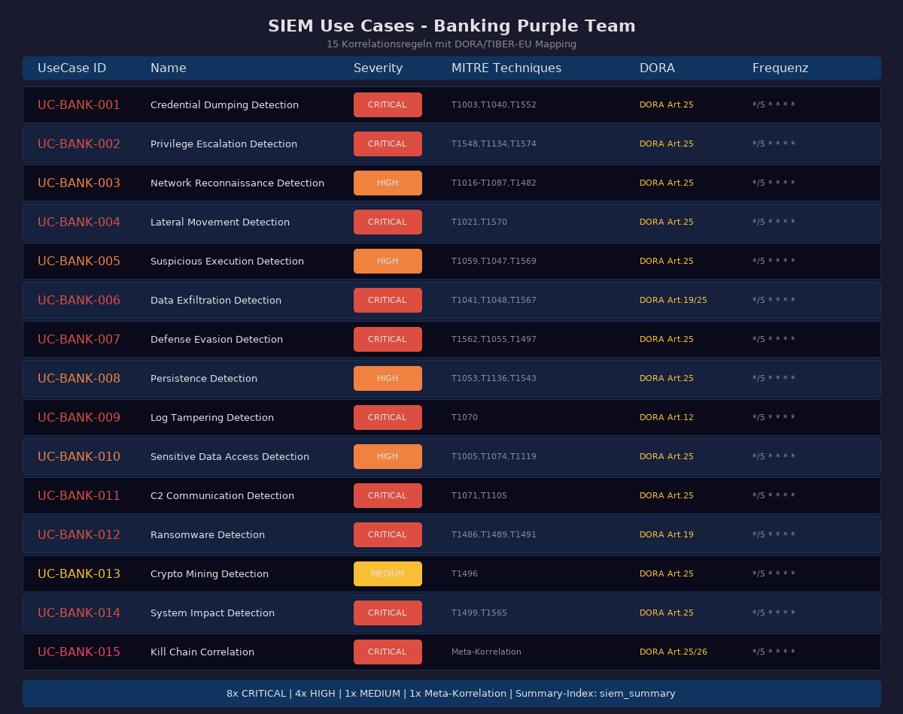
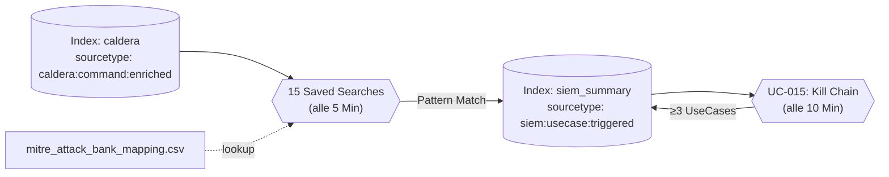
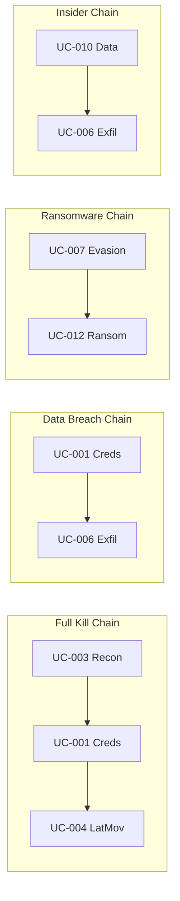

# SIEM Use Cases - Banking Purple Team

> 15 Korrelationsregeln für die Validierung der SIEM-Erkennung



## Übersicht

```mermaid
graph TD
    subgraph Critical["CRITICAL - Sofortige Eskalation"]
        UC1[UC-001 Credential Dumping]
        UC2[UC-002 Privilege Escalation]
        UC4[UC-004 Lateral Movement]
        UC6[UC-006 Data Exfiltration]
        UC7[UC-007 Defense Evasion]
        UC9[UC-009 Log Tampering]
        UC11[UC-011 C2 Communication]
        UC12[UC-012 Ransomware]
        UC14[UC-014 System Impact]
        UC15[UC-015 Kill Chain Corr.]
    end

    subgraph High["HIGH - Zeitnahe Bearbeitung"]
        UC3[UC-003 Network Recon]
        UC5[UC-005 Suspicious Exec]
        UC8[UC-008 Persistence]
        UC10[UC-010 Sensitive Data]
    end

    subgraph Medium["MEDIUM"]
        UC13[UC-013 Crypto Mining]
    end

    UC1 & UC4 & UC6 -->|"≥3 in 30min"| UC15

    style Critical fill:#2a0a0a,stroke:#dc4e41
    style High fill:#2a1a0a,stroke:#f1813f
    style Medium fill:#2a2a0a,stroke:#f8be34
```



## Datenfluss



---

## UC-BANK-001: Credential Dumping Detection

| Eigenschaft | Wert |
|------------|------|
| **Schweregrad** | CRITICAL |
| **MITRE** | T1003, T1003.001, T1003.003, T1040, T1552 |
| **Frequenz** | `*/5 * * * *` |
| **DORA** | Art. 25 (Resilienz), Art. 26 (TLPT) |
| **Bank-Risiko** | Zugriff auf Bankkonten, SWIFT-Credentials, HSM-Keys |

**Erkennungslogik:**
```spl
index=caldera sourcetype="caldera:command:enriched"
  (technique_id="T1003*" OR technique_id="T1040*" OR technique_id="T1552*"
   OR command_decoded="*mimikatz*" OR command_decoded="*procdump*"
   OR command_decoded="*lsass*" OR command_decoded="*sekurlsa*")
| lookup mitre_attack_bank_mapping technique_id
| eval usecase_id="UC-BANK-001"
| collect index=siem_summary sourcetype="siem:usecase:triggered"
```

**Remediation:** Sofort-Isolierung, Passwort-Reset aller betroffenen Accounts, Prüfung auf Lateral Movement

---

## UC-BANK-002: Privilege Escalation Detection

| Eigenschaft | Wert |
|------------|------|
| **Schweregrad** | CRITICAL |
| **MITRE** | T1548, T1548.002, T1134, T1574 |
| **Bank-Risiko** | Erhöhte Rechte für Kernbanksystem-Zugriff |
| **Remediation** | UAC-Härtung, Least-Privilege, AppLocker |

---

## UC-BANK-003: Network Reconnaissance Detection

| Eigenschaft | Wert |
|------------|------|
| **Schweregrad** | HIGH (kumuliert CRITICAL bei ≥4 Techniken) |
| **MITRE** | T1016, T1018, T1049, T1057, T1082, T1083, T1087, T1482 |
| **Besonderheit** | Kumulations-Erkennung: ≥3 Events ODER ≥2 verschiedene Techniken in 10 Min |

---

## UC-BANK-004: Lateral Movement Detection

| Eigenschaft | Wert |
|------------|------|
| **Schweregrad** | CRITICAL |
| **MITRE** | T1021, T1021.002, T1021.004, T1021.006, T1570 |
| **Bank-Risiko** | Überwindung DMZ → Kernbanksystem |
| **TIBER-EU** | Testet Netzwerksegmentierung |

---

## UC-BANK-005: Suspicious Execution Detection

| Eigenschaft | Wert |
|------------|------|
| **Schweregrad** | HIGH |
| **MITRE** | T1059, T1059.001, T1047, T1569 |
| **Muster** | Encoded PowerShell, IEX/DownloadString, WMI, Service Creation |

---

## UC-BANK-006: Data Exfiltration Detection

| Eigenschaft | Wert |
|------------|------|
| **Schweregrad** | CRITICAL |
| **MITRE** | T1041, T1048, T1029, T1030, T1567, T1537 |
| **Compliance** | DSGVO Art. 33 (72h Meldepflicht), DORA Art. 19 |
| **Bank-Risiko** | Kundendaten-Abfluss, Reputationsschaden |

---

## UC-BANK-007: Defense Evasion Detection

| Eigenschaft | Wert |
|------------|------|
| **Schweregrad** | CRITICAL |
| **MITRE** | T1562, T1055, T1497 |
| **Muster** | AV/EDR-Deaktivierung, Process Injection, Sandbox-Checks |

---

## UC-BANK-008: Persistence Detection

| Eigenschaft | Wert |
|------------|------|
| **Schweregrad** | HIGH |
| **MITRE** | T1053, T1136, T1543 |
| **Bank-Risiko** | Langfristiger APT-Zugang, Backdoor in Produktion |

---

## UC-BANK-009: Log Tampering Detection

| Eigenschaft | Wert |
|------------|------|
| **Schweregrad** | CRITICAL |
| **MITRE** | T1070, T1070.001, T1070.003, T1070.004 |
| **Compliance** | MaRisk AT 7.2 (lückenlose Protokollierung), DORA Art. 12 |

---

## UC-BANK-010: Sensitive Data Access

| Eigenschaft | Wert |
|------------|------|
| **Schweregrad** | HIGH |
| **MITRE** | T1005, T1074, T1113, T1115, T1119, T1560 |

---

## UC-BANK-011: C2 Communication Detection

| Eigenschaft | Wert |
|------------|------|
| **Schweregrad** | CRITICAL |
| **MITRE** | T1071, T1105 |
| **Bank-Risiko** | Aktive Fernsteuerung von Bankinfrastruktur |

---

## UC-BANK-012: Ransomware Detection

| Eigenschaft | Wert |
|------------|------|
| **Schweregrad** | CRITICAL |
| **MITRE** | T1486, T1489, T1491 |
| **Compliance** | DORA Art. 19 (sofortige Meldung an BaFin/EZB) |

---

## UC-BANK-013: Crypto Mining Detection

| Eigenschaft | Wert |
|------------|------|
| **Schweregrad** | MEDIUM |
| **MITRE** | T1496 |

---

## UC-BANK-014: System Impact Detection

| Eigenschaft | Wert |
|------------|------|
| **Schweregrad** | CRITICAL |
| **MITRE** | T1499, T1565 |
| **Bank-Risiko** | Business-Continuity-Gefährdung |

---

## UC-BANK-015: Kill Chain Correlation

| Eigenschaft | Wert |
|------------|------|
| **Schweregrad** | CRITICAL |
| **Frequenz** | `*/10 * * * *` |
| **Trigger** | ≥3 verschiedene Use Cases in 30 Minuten auf demselben Host |

**Erkennungslogik:**
```spl
index=siem_summary sourcetype="siem:usecase:triggered"
| bin _time span=30m
| stats dc(usecase_id) as usecase_count
        values(usecase_id) as triggered_usecases
        by _time host operation_name
| where usecase_count >= 3
| eval kill_chain_phase=case(
    match(triggered_usecases, "UC-BANK-003") AND match(triggered_usecases, "UC-BANK-001")
      AND match(triggered_usecases, "UC-BANK-004"),
    "Full Kill Chain: Recon→Credentials→LateralMovement",
    ...)
| collect index=siem_summary sourcetype="siem:usecase:killchain"
```

**Korrelations-Muster:**


