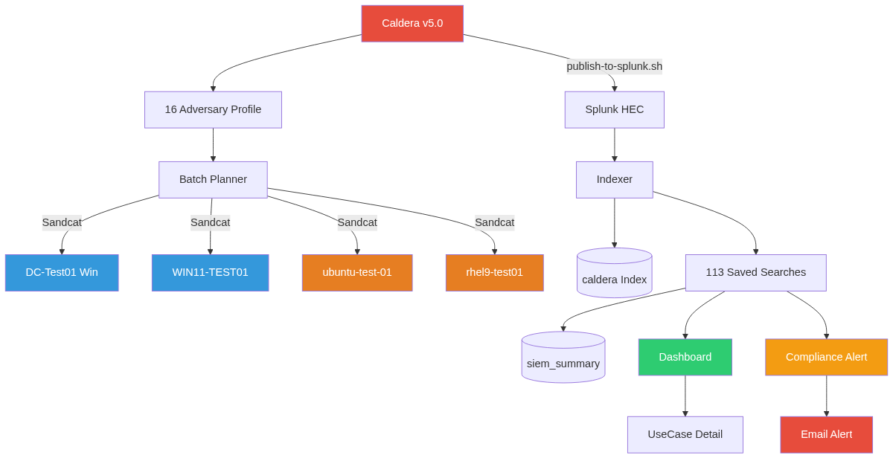
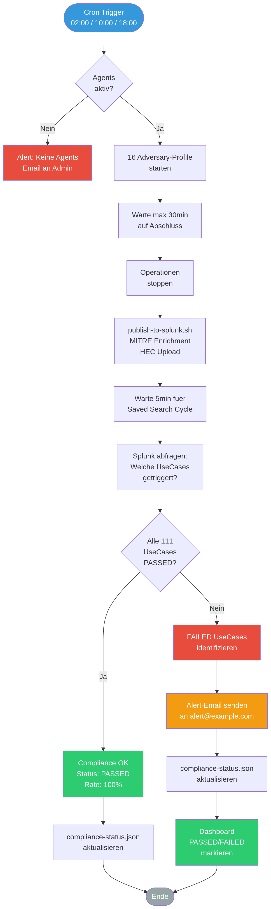
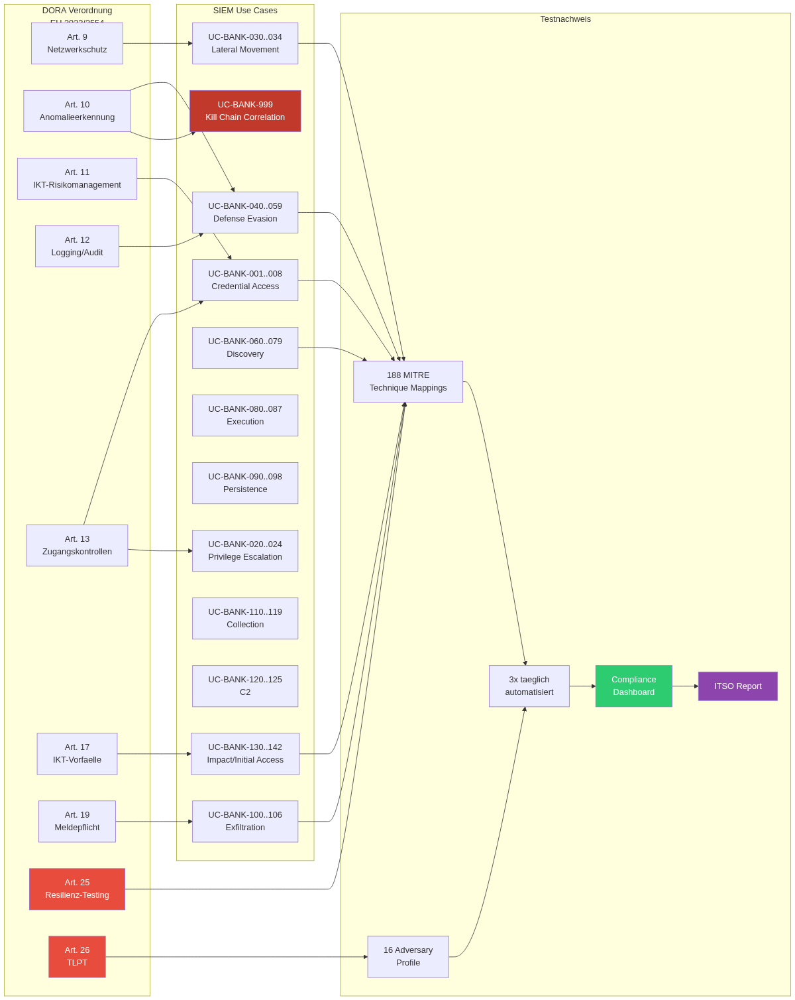
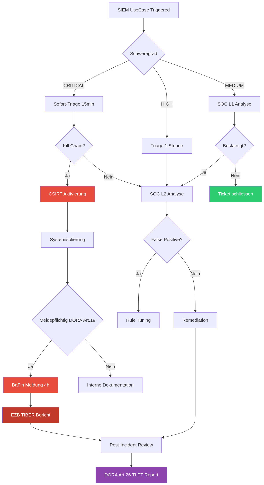

# TIBER/DORA Bank Purple Team Framework v2.0

> Automatisierte Adversary-Emulation und SIEM-UseCase-Validierung fuer mittelstaendische Banken



---

## Was ist dieses Projekt?

Dieses Framework stellt ein vollstaendiges **Purple Team Testing Setup** bereit, mit dem Banken ihre SIEM-Erkennung gegen aktuelle Bedrohungen (2025/2026) validieren koennen - konform mit DORA, TIBER-EU, BaFin MaRisk und BAIT.

| Komponente | Umfang |
|-----------|--------|
| Caldera Adversary-Profile | 16 Banking-Szenarien, 227 Abilities |
| SIEM Use Cases | 111 Erkennungsregeln ueber 12 MITRE Taktiken |
| MITRE ATT&CK Mapping | 188 Technique-to-UseCase Zuordnungen |
| Automatisierung | 3x taegliche Ausfuehrung mit Compliance-Monitoring |
| Alerting | Email bei FAILED UseCases |
| Splunk App | Dashboards mit PASSED/FAILED Status und Drilldown |

---

## Architektur



### Datenfluss

1. **Caldera** fuehrt 16 Adversary-Profile gegen Test-Agents aus
2. **publish-to-splunk.sh** enriched die Ergebnisse mit MITRE ATT&CK Mapping
3. **Splunk** nimmt Events via HEC entgegen und fuehrt 113 Saved Searches aus
4. **Dashboards** zeigen PASSED/FAILED Status pro UseCase
5. **Compliance Alerts** werden per Email versendet

---

## DORA Compliance



| DORA Artikel | Anforderung | Abdeckung |
|-------------|-------------|-----------|
| Art. 24 | IKT-Resilienztests | 3x taegliche automatisierte Tests |
| Art. 25 | IKT-Instrumente testen | 111 SIEM Use Cases |
| Art. 26 | TLPT | 16 Threat-Intel-basierte Profile |
| Art. 19 | Meldepflicht | Automatische Eskalation |

---

## Eskalationsprozess



---

## Use Case Uebersicht

| Taktik | Use Cases | Beispiele |
|--------|-----------|-----------|
| Credential Access | UC-001..008 | Mimikatz, LSASS Dump, Kerberoasting |
| Privilege Escalation | UC-020..024 | UAC Bypass, Token Manipulation |
| Lateral Movement | UC-030..034 | PsExec, WinRM, SSH, SMB |
| Defense Evasion | UC-040..059 | AV Disable, Process Injection, Log Tampering |
| Discovery | UC-060..079 | BloodHound, Network Scanning, AD Enumeration |
| Execution | UC-080..087 | PowerShell, WMI, Scheduled Tasks |
| Persistence | UC-090..098 | Cron, Services, Registry Run Keys |
| Exfiltration | UC-100..106 | C2 Channel, FTP, Cloud Upload |
| Collection | UC-110..119 | Keylogging, Screen Capture, Clipboard |
| C2 | UC-120..125 | DNS Tunneling, Proxy, Non-Standard Ports |
| Impact | UC-130..139 | Ransomware, Service Stop, Data Wipe |
| Initial Access | UC-140..142 | Valid Accounts, Phishing |

Vollstaendiger Katalog: [USECASE_CATALOG.md](docs/USECASE_CATALOG.md)

---

## Schnell-Deployment

```bash
git clone https://github.com/icepaule/IceUseCaseTesting.git
cd IceUseCaseTesting

# Konfiguration anpassen
export CALDERA_API_KEY=<API_KEY>
export SPLUNK_HOST=<SPLUNK_IP>
export SPLUNK_PASS=<PASSWORD>

# Framework deployen
./scripts/deploy-siem-framework.sh all

# Agents deployen
./scripts/deploy-linux-agent.sh -t <TARGET> -u <USER> -p <PASS>

# Cron installieren (3x/Tag)
crontab scripts/caldera-cron
```

---

## Dokumentation

- [Hauptdokumentation](docs/README.md) - Vollstaendige technische Doku mit DORA/BaFin/EZB Mapping
- [ITSO Report Template](docs/ITSO_REPORT_TEMPLATE.md) - Vorlage fuer regulatorische Berichte
- [UseCase Katalog](docs/USECASE_CATALOG.md) - Alle 111 SIEM Use Cases im Detail
- [SIEM Dokumentation](docs/SIEM_USECASES_DOKUMENTATION.md) - Originale SIEM UseCase Doku

---

## Regulatorischer Rahmen

- **DORA** (EU 2022/2554) - Digital Operational Resilience Act
- **TIBER-EU** - EZB Threat Intelligence-Based Ethical Red Teaming
- **BaFin MaRisk** AT 7.2 - IT-Risikomanagement
- **BAIT** Abschnitt 5 - Informationssicherheitsmanagement
- **EBA/GL/2019/04** - Guidelines on ICT and Security Risk Management

---

*Dieses Framework dient ausschliesslich zu Test- und Validierungszwecken in kontrollierten Umgebungen.*
